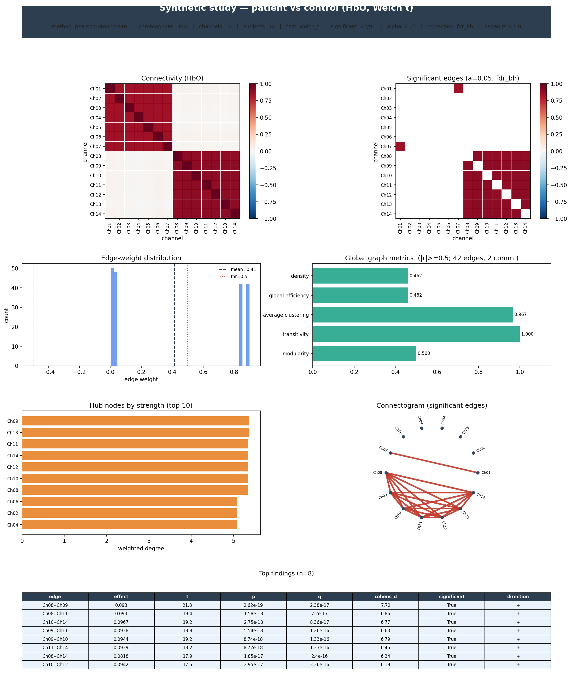

# cedanirs

**Functional and effective connectivity analysis for fNIRS data** — estimation,
statistical testing, graph-theoretic characterisation, visualisation and
reporting, in one extensible package.

> Status: early alpha. The architecture and public API are in place, with four
> functional estimators shipped (Pearson, Spearman, partial correlation,
> coherence) and effective methods slotting into the same framework.

## Why

Analysing brain connectivity from functional near-infrared spectroscopy (fNIRS)
spans a whole pipeline: from preprocessed haemoglobin time series, through a
chosen connectivity estimator, to significance testing across hundreds of
simultaneous channel pairs, network metrics, figures and a written report.
cedanirs provides solid, reusable foundations for that pipeline and makes adding
a new method a two-line affair — without reinventing numpy, scipy, networkx or
matplotlib.

## Install

```bash
pip install -e .            # core (numpy, scipy, xarray, pandas, matplotlib, networkx)
pip install -e .[dev]       # + test/lint tooling
pip install -e .[io]        # + raw-recording loaders (mne, mne-nirs, snirf)
pip install -e .[cedalion]  # + cedalion preprocessing backend
pip install -e .[effective] # + statsmodels (for upcoming effective methods)
```

## Quick start

```python
import numpy as np
import cedanirs as cn

# data: (n_channels, n_times), already preprocessed (e.g. HbO, band-passed)
data = np.random.default_rng(0).standard_normal((20, 600))

result = cn.connectivity(
    data,
    method="pearson",
    sfreq=10.0,
    channels=[f"S{i//2+1}_D{i%2+1}" for i in range(20)],
)

m = result.matrix              # a ConnectivityMatrix (one chromophore)
m.values                       # the N×N numpy array
m.to_dataframe()               # labelled pandas DataFrame
m.plot()                       # heatmap (matplotlib Axes)

mask = m.significant(0.05, correction="fdr_bh")   # FDR-corrected mask
m.plot(mask=~mask)             # show only significant edges

g = m.to_graph(threshold=0.3)              # networkx graph
metrics = cn.graph.graph_metrics(m, threshold=0.3)

print(result.report())         # human-readable text report
```

Multi-chromophore input (3-D `(chromophore, channel, time)`) yields one matrix
per chromophore:

```python
cube = np.stack([hbo, hbr])                 # (2, n_channels, n_times)
result = cn.connectivity(cube, chromophores=["HbO", "HbR"])
result["HbO"].plot()
```

Choose a different estimator:

```python
cn.connectivity(data, method="spearman")                         # rank correlation
cn.connectivity(data, method="partial")                          # controls for all other channels
cn.connectivity(data, method="coherence", sfreq=10.0,            # frequency-domain
                fmin=0.01, fmax=0.1)
```

Discover available methods:

```python
cn.list_estimators()
# [{'name': 'coherence',  'kind': 'functional', 'directed': False, 'domain': 'frequency'},
#  {'name': 'partial',    'kind': 'functional', 'directed': False, 'domain': 'time'},
#  {'name': 'pearson',    'kind': 'functional', 'directed': False, 'domain': 'time'},
#  {'name': 'spearman',   'kind': 'functional', 'directed': False, 'domain': 'time'}]
```

## Group-level analysis, statistics & output

Connectivity science is group science. Collect each subject's result into a
`Study`, then run rigorous edgewise tests — aggregated and tested in Fisher-z
space, restricted to the unique edges, and multiple-comparison corrected.

```python
study = cn.Study(name="patients-vs-controls")
for sid, recording in recordings.items():
    res = cn.connectivity(recording, method="pearson")
    study.add(sid, res, group=group_of[sid], age=age_of[sid])

# One-sample: which connections are reliably present in the group?
g = study.group("HbO")
stat = g.one_sample()                          # t, p, FDR-q, Cohen's d, CI per edge
print(stat.table())                            # tidy DataFrame of significant edges
print(cn.report.summarize_group(stat))         # sectioned text report

# Two-sample / paired / regression contrasts
ctrl, pat = study.group("HbO", group="control"), study.group("HbO", group="patient")
diff = pat.two_sample(ctrl)                     # Welch t per edge (paired=True for within-subject)
beta = g.regression(study.metadata[["age"]], predictor="age")   # brain–behaviour

# Network-Based Statistic — FWE-corrected significant sub-networks (Zalesky 2010)
nbs = pat.nbs(ctrl, threshold=3.0, n_permutations=5000)
print(nbs.table())

# Everything is poster- and table-ready
cn.build_poster(stat, group_mean=g.mean())     # whole pipeline in one figure
stat.table().to_csv("significant_edges.csv")
```

* **Designs**: one-sample (FC ≠ 0), two-sample (Welch/pooled), paired, OLS
  regression on covariates, and the Network-Based Statistic.
* **Per edge**: effect (group-mean r or mean difference), t, df, p, FDR/Bonferroni
  q, Cohen's d / Hedges' g, and confidence intervals.
* **Output**: `build_poster()` (metadata → matrices → significance → edge
  distribution → graph metrics → hubs → connectogram → findings table),
  `cn.tables.*` significant-findings DataFrames (CSV/Markdown), and
  `cn.report.result_report()` (a JSON-serialisable nested dict) /
  `summarize_group()` text.

A `GroupStatResult.to_matrix()` returns an ordinary `ConnectivityMatrix`, so the
entire single-subject surface (`.plot`, `.significant`, graph metrics, tables)
works on group results unchanged. See `example_group.py` for a runnable
end-to-end demo.

The whole pipeline renders to a single poster figure. Below is the committed
output of a deterministic synthetic two-group study (16 controls vs 16 patients;
regenerate with `python examples/generate_outputs.py`):



Exported alongside it: [`significant_edges.csv`](examples/output/significant_edges.csv),
[`nodal_metrics.csv`](examples/output/nodal_metrics.csv),
[`nbs_components.csv`](examples/output/nbs_components.csv) and
[`group_report.txt`](examples/output/group_report.txt).

## Architecture

```
cedanirs/
  api.py                  connectivity(data, method=...) — the one-liner entry point
  core/
    types.py              Chromophore, ConnectivityKind, Domain
    exceptions.py         CedanirsError hierarchy
    timeseries.py         NirsTimeSeries — labelled (chromophore, channel, time) cube
    result.py             ConnectivityMatrix / ConnectivityResult — rich results
    group.py              Study + GroupConnectivity — the group data model
    registry.py           register_estimator / get / create / list (the plugin system)
  estimators/
    base.py               ConnectivityEstimator ABC (does the plumbing)
    functional/           pearson, spearman, partial, coherence  (shipped)
    effective/granger.py  Granger skeleton (extension template)
  stats/                  Fisher-z, p-values, FDR/Bonferroni
    group.py              one_sample / two_sample / paired / regression / nbs
    _results.py           GroupStatResult / NBSResult
  graph/                  networkx-backed graph + topology metrics
  tables.py               significant-findings DataFrames (edges, nodes, NBS)
  viz/                    matrix heatmap (matrix.py) + build_poster (poster.py)
  report/                 text + result_report() dict; group.py for group reports
  preprocessing/          configurable pipeline (cedalion backend, lazy)
```

**Design principles**

- **Dependency-light core.** Only numpy/scipy/xarray/pandas/matplotlib/networkx.
  Heavy I/O (cedalion, mne) and effective-connectivity backends are optional
  extras, imported lazily.
- **Extensible from day one.** Adding a method = subclass `ConnectivityEstimator`,
  implement `_estimate(x)` (the N×N math on a 2-D array), decorate with
  `@register_estimator`. Chromophore iteration, labelling, p-value plumbing and
  result assembly are inherited.
- **Rich, labelled results.** Matrices are xarray-backed and know how to
  threshold, become graphs, test significance, tabulate, and plot themselves.

## Adding a new connectivity method

```python
import numpy as np
from cedanirs import register_estimator
from cedanirs.estimators.base import ConnectivityEstimator, EstimateOutput
from cedanirs.core.types import ConnectivityKind

@register_estimator(name="cosine")
class CosineSimilarity(ConnectivityEstimator):
    """Cosine similarity between channel time series."""
    name = "cosine"
    kind = ConnectivityKind.FUNCTIONAL
    directed = False

    def _estimate(self, x: np.ndarray) -> EstimateOutput:
        norm = np.linalg.norm(x, axis=1, keepdims=True)
        unit = x / norm
        return EstimateOutput(matrix=unit @ unit.T)

# immediately usable:
# cn.connectivity(data, method="cosine")
```

Spearman, partial correlation and coherence ship built in — see
`cedanirs/estimators/functional/` for production implementations.

See `cedanirs/estimators/effective/granger.py` for a worked directed-method
template.

## Roadmap

- Functional: wavelet coherence, phase-locking value, mutual information
  (Pearson, Spearman, partial correlation and coherence are already shipped).
- Effective: Granger causality, transfer entropy, DCM.
- Reliability: edgewise ICC and brain-fingerprinting / identifiability
  (group one/two-sample/paired/regression and NBS are already shipped).
- Graph-metric group comparison at matched density; small-worldness vs nulls.
- Glass-brain / montage node-link visualisations; HTML & PDF reports.
- Raw-recording loaders and a complete cedalion preprocessing backend.

## License

MIT
