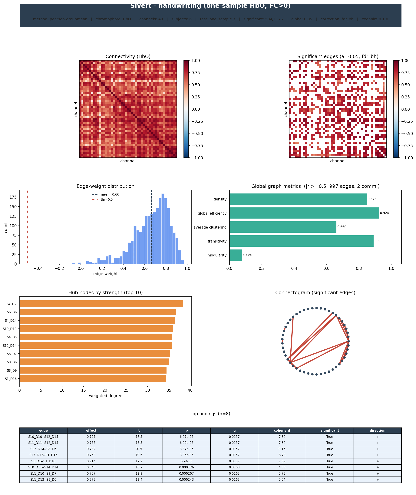

# Case study: writing-modality functional connectivity

A real-data application of `cedanirs` to an fNIRS study of four writing input
methods. It exercises the full group pipeline: per-subject run aggregation →
group connectomes → within-subject condition contrasts → posters, tables and
reports.

> The raw SNIRF recordings are **not** included (human-subject data). This folder
> holds the analysis script and its committed outputs. To reproduce, point the
> script at your data with `SIVERT_ROOT=/path/to/data python run_connectivity.py`
> (expects `results/<condition>/*.snirf`).

## Design

- **6 subjects × 4 conditions**: handwriting, iPad, keyboard, reMarkable.
- Multiple runs per subject/condition (24 subject–condition cells, ~102 runs).
- Already-processed HbO/HbR SNIRF. The recordings are heterogeneous: sampling
  rate varies (5–12 Hz), length varies, and each file kept a different subset of
  source-detector channels after QC (full montage = **66** distinct pairs; 28
  common to every subject).

## Pipeline

1. Read each run with cedanirs' **native h5py SNIRF reader** (`cn.read_timeseries`,
   no MNE — the files are already HbO/HbR) and band-pass **0.01–0.1 Hz**; runs
   shorter than 60 s are skipped.
2. Pearson connectivity per run; **Fisher-z** average a subject's runs (union of
   channels) → one matrix per (subject, condition).
3. Group analyses (`cedanirs`) on the **full montage** — channels present in ≥ 50 %
   of subjects (49 channels, 1176 edges), NaN-aware where a recording lacks one:
   - **per condition** — one-sample edgewise test (FC > 0), FDR-BH;
   - **every condition pair** — paired (within-subject) contrast, FDR-BH.

See [`output/summary.txt`](output/summary.txt) and
[`output/loading_log.txt`](output/loading_log.txt) (per-run sfreq/length/channels).

## Results

**Each condition has a strong, reliable group connectome** (one-sample HbO, FC > 0,
FDR `q < 0.05`, 49 channels / 1176 edges):

| condition   | significant edges |
|-------------|-------------------|
| handwriting | 504 / 1176 |
| iPad        | 1092 / 1176 |
| keyboard    | 810 / 1176 |
| reMarkable  | 1125 / 1176 |

**No connectivity differences between writing modalities.** Every pairwise paired
contrast yields **0** FDR-significant edges, and the *uncorrected* counts (25–96 of
1176, around the ~59 expected by chance) confirm this is a genuine null rather than
low power — even on the full montage, resting-band HbO connectivity does not
distinguish the four input methods at this sample size.

## Outputs

- `output/per_condition/<cond>_poster.png` — full-pipeline poster per condition
- `output/per_condition/<cond>_significant_edges.csv` — significant edges + stats
- `output/per_condition/<cond>_report.txt` — text report
- `output/contrasts/<a>_vs_<b>_edges.csv` — every paired contrast (sorted by q)
- `output/contrasts/handwriting_vs_keyboard_poster.png` — headline contrast
- `output/summary.txt`, `output/loading_log.txt`

## Caveats

Small sample (n = 6); recordings are heterogeneous (sfreq 5–12 Hz, varying length
and channel subsets), so per-edge subject counts vary across the montage; HbO only
in the summary tables (HbR available by re-running). Treat the per-condition
connectomes as descriptive and the null contrasts as "no detectable difference at
this power", not proof of equivalence.
